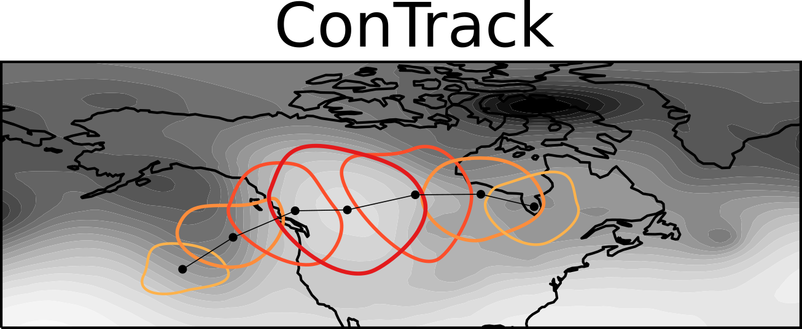
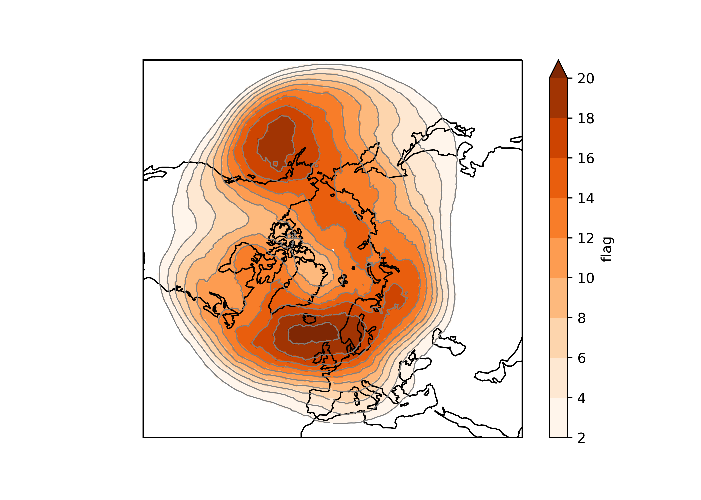
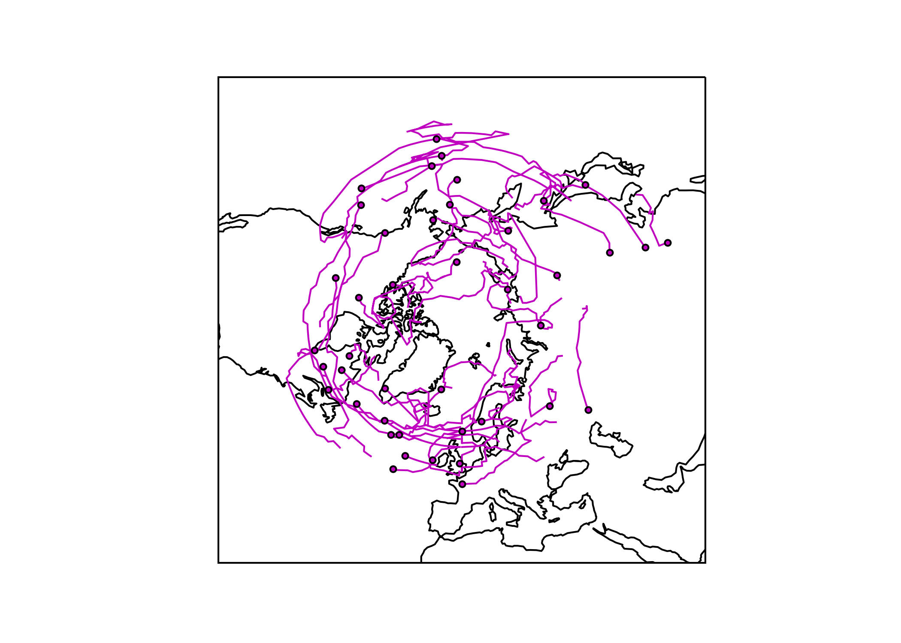

###########################
ConTrack - Contour Tracking
###########################
==================================================================================
Spatial and temporal tracking of circulation anomalies in weather and climate data
==================================================================================

ConTrack is a Python package intended to simpify the process of automatically tracking and analyzing synoptic weather features (individual systems or long-term climatology) in weather and climate datasets. This feature-based tool is mostly used to track and characterize the life cycle of atmospheric blocking, but can also be used to identify other type of anomalous features, e.g., upper-level troughs and ridges (storm track). It is built on top of `xarray`_ and `scipy`_.

ConTrack is based on the atmospheric blocking index by `Schwierz et al. (2004) <https://doi.org/10.1029/2003GL019341>`_ (written in Fortran) developed at the `Institute for Atmospheric and Climate Science, ETH Zurich <https://iac.ethz.ch/group/atmospheric-dynamics.html>`_.

See also:  

- `Scherrer et al. (2005) <https://doi.org/10.1002/joc.1250>`_: 
- `Croci-Maspoli et al. (2007) <https://doi.org/10.1175/JCLI4029.1>`_
- `Pfahl et al. (2015) <https://www.nature.com/articles/ngeo2487>`_
- `Woollings et al. (2018) <https://link.springer.com/article/10.1007/s40641-018-0108-z#appendices>`_
- `Steinfeld and Pfahl (2019) <https://doi.org/10.1007/s00382-019-04919-6>`_
- `Steinfeld et al. (2020) <https://wcd.copernicus.org/articles/1/405/2020/wcd-1-405-2020.html>`_
- and used in many more atmospheric blocking studies...

The ERA-Interim global blocking climatology based on upper-level potential vorticity used in Steinfeld and Pfahl (2019) is publicly available via an ETH Zurich-based web server [`http://eraiclim.ethz.ch/ <http://eraiclim.ethz.ch/>`_ , see `Sprenger et al. (2017) <https://doi.org/10.1175/BAMS-D-15-00299.1>`_].  

..
  References
.. _xarray: https://xarray.pydata.org/en/stable/
.. _scipy: https://www.scipy.org/

============
Referencing
============

| Please cite **ConTrack** in your publication: *Steinfeld, D., 2020: ConTrack - Contour Tracking. GitHub, https://github.com/steidani/ConTrack*.   
| In case you are using the blocking index, please also cite: *Schwierz, C., Croci-Maspoli, M., and Davies, H. C., 2004: Perspicacious indicators of atmospheric blocking, Geophys. Res. Lett., 31, 0094–8276, https://doi.org/10.1029/2003GL019341*.   
|
| Be aware that this is a free scientific tool in continous development, then it may not be free of bugs. Please report any issue on the GitHub portal.

============
Installation
============

Using pip
---------

Ideally install it in a virtual environment.

.. code:: bash

    pip install contrack
    
Make sure you have the required dependencies (for details see docs/environment.yml):

- xarray
- scipy
- pandas
- numpy
- netCDF4
- (for plotting on geographical maps: matplotlib and cartopy)
- (for parallel computing: dask)
 
To install the development version (master), do:

.. code:: bash

    pip install git+https://github.com/steidani/ConTrack

Copy from Github repository
---------------------------

Copy/clone locally the latest version from ConTrack:

.. code-block:: bash

    git clone git@github.com:steidani/ConTrack.git /path/to/local/contrack
    cd path/to/local/contrack

Prepare the conda environment:

.. code-block:: bash

    conda create -y -q -n contrack_dev python=3.8.5 pytest
    conda env update -q -f docs/environment.yml -n contrack_dev

Install contrack in development mode in contrack_dev:

.. code-block:: bash

    conda activate contrack_dev
    pip install -e .

Run the tests:

.. code-block:: bash

    python -m pytest

==========
Tutorial
==========

Example: Calculate blocking climatology 
---------------------------------------

.. code-block:: python 
   
   # import contrack module 
   from contrack import contrack

   # initiate blocking instance
   block = contrack()
   
   # read ERA5 Z500 (geopotential at 500 hPa) daily global data from 19810101_00 to 20101231_00 with 1° spatial resolution)
   # downloaded from https://cds.climate.copernicus.eu
   block.read('data/era5_1981-2010_z_500.nc')
   block
   # Out[]:	Xarray dataset with 10957 time steps. 
   #	     	Available fields: z

   # select only winter months January, February and December
   block.ds = block.ds.sel(time=block.ds.time.dt.month.isin([1, 2, 12]))
   # xarray.Dataset (and all its functions) can be accessed with block.ds

   # calculate geopotential height
   block.calculate_gph_from_gp(gp_name='z',
                               gp_unit='m**2 s**-2',
                               gph_name='z_height')
   
   # Hint: Use block.set_up(...) to do consistency check and set (automatically or manually) names of dimension ('time', 'latitude', 'longitude')
   
   # calculate Z500 anomaly (temporally smoothed with a 2 d running mean) with respect to the 31-day running mean (long-term: 30 years) climatology
   block.calc_anom(variable='z_height', 
                   smooth=2,
                   window=31,
                   groupby='dayofyear')
   # Hint: Use 'clim=...' to point towards an existing climatological mean (useful for weather forecasts)
   # output: variable 'anom'.

   # Finally, track blocking anticyclones (>=150gmp, 50% overlap twosided, 5 timesteps persistence (here 5 days))
   block.run_contrack(variable='anom',
   		      threshold=160,
		      gorl='>=',
		      overlap=0.5,
		      persistence=5,
		      twosided=True)
   # output: variable 'flag'. 440 blocking systems tracked. Each blocking system is identified by a unique flag/ID.
   block
   # Out[]:	Xarray dataset with 2707 time steps. 
   #	     	Available fields: z, z_height, anom, flag
   
   # Hint: In case you want to use a more objective threshold, e.g., the 90th percentile of the Z500 anomaly winter distribution over 50°-80°N, do: 
   # threshold = block['anom'].sel(latitude=slice(80, 50)).quantile([0.90], dim='time').mean() # 177gmp
   
   # save to disk
   block['flag'].to_netcdf('data/flag.nc')

   # plotting blocking frequency (in %) for winter over Northern Hemisphere
   import matplotlib.pyplot as plt
   import cartopy.crs as ccrs

   fig, ax = plt.subplots(figsize=(7, 5), subplot_kw={'projection': ccrs.NorthPolarStereo()})
   (xr.where(block['flag']>1,1,0).sum(dim='time')/block.ntime*100).plot(levels=np.arange(2,18,2), cmap='Oranges', extend = 'max', transform=ccrs.PlateCarree())
   (xr.where(block['flag']>1,1,0).sum(dim='time')/block.ntime*100).plot.contour(colors='grey', linewidths=0.8, levels=np.arange(2,18,2), transform=ccrs.PlateCarree())
   ax.set_extent([-180, 180, 30, 90], crs=ccrs.PlateCarree()); ax.coastlines();
   plt.show()

Example: Calculation of blocking characteristics for life cycle analysis 
------------------------------------------------------------------------

Using the output 'flag' from block.run_contrack() to calculate blocking intensity, size, center of mass, age from genesis to lysis for each tracked feature.

.. code-block:: python 

   # flag = output of block.run_contrack(), variable = input variable to calculate intensity and center of mass
   block_df = block.run_lifecycle(flag='flag', variable='anom')
   
   # output is a pandas.DataFrame
   print(block_df)
	      Flag         Date  Longitude  Latitude  Intensity        Size
	0        3  19810101_00        333        48     226.45  6490603.17
	1        3  19810102_00        335        47     210.77  6466790.05
	2        3  19810103_00        331        47     189.00  4169702.52
	3        3  19810104_00        331        49     190.78  3289504.87
	4        3  19810105_00        331        50     203.66  4231433.19
	   ...          ...        ...       ...        ...         ...
	3832  6948  20101221_00        357       -53     206.02  5453454.76
	3833  6948  20101222_00          0       -56     208.80  5205585.69
	3834  6948  20101223_00          3       -56     190.23  6324017.70
	3835  6948  20101224_00          3       -57     214.02  5141693.22
	3836  6948  20101225_00          5       -55     211.33  7606108.76

   # save result to disk
   block_df.to_csv('data/block.csv', index=False)
   
   # plotting blocking track (center of mass) and genesis 
   f, ax = plt.subplots(1, 1, figsize=(7,5), subplot_kw=dict(projection=ccrs.NorthPolarStereo()))
   ax.set_extent([-180, 180, 30, 90], crs=ccrs.PlateCarree()); ax.coastlines()
   ax.coastlines() # add coastlines
     
   #need to split each blocking track due to longitude wrapping (jumping at map edge) 
   for bid in np.unique(np.asarray(block_df['Flag'])): #select blocking id    
       lons = np.asarray(block_df['Longitude'].iloc[np.where(block_df['Flag']==bid)])
       lats = np.asarray(block_df['Latitude'].iloc[np.where(block_df['Flag']==bid)])
    
       # cosmetic: sometimes there is a gap near map edge where track is split: 
       lons[lons >= 355] = 359.9
       lons[lons <= 3] = 0.1
       segment = np.vstack((lons,lats))  
    
       #move longitude into the map region and split if longitude jumps by more than "threshold"
       lon0 = 0 #center of map
       bleft = lon0-0.                                                                            
       bright = lon0+360
       segment[0,segment[0]> bright] -= 360                                                                 
       segment[0,segment[0]< bleft]  += 360
       threshold = 180  # CHANGE HERE                                                                                    
       isplit = np.nonzero(np.abs(np.diff(segment[0])) > threshold)[0]                                                                                         
       subsegs = np.split(segment,isplit+1,axis=+1)

       #plot the tracks
       for seg in subsegs:                                                                                  
           x,y = seg[0],seg[1]                                                                          
           ax.plot(x ,y,c = 'm',linewidth=1, transform=ccrs.PlateCarree())  
       #plot the starting points
       ax.scatter(lons[0],lats[0],s=11,c='m', zorder=10, edgecolor='black', transform=ccrs.PlateCarree())  

==========
What's New
==========

v0.3.0 (18.04.2021): 
--------------------

- bugfix: see Issue calc_clim error.

v0.2.0 (19.10.2020): 
--------------------

- first release on pypi
- calculate anomalies based on pre-defined climatology: ``calc_anom(clim=...)``.
- better handling of dimensions using ``set_up()`` function.
- twosided or forward overlap criterion: ``run_contrack(twosided=True)``.
- ``run_lifecycle()``: temporal evolution of intensity, spatial extent, center of mass and age from genesis to lysis for individual features.

v0.1.0 (20.04.2020): 
--------------------

- Extended functionality: Calculate anomalies from daily or monthly or seasonal... (long-term) climatology with moving average window: ``calc_anom(groupby=..., window=...)``
